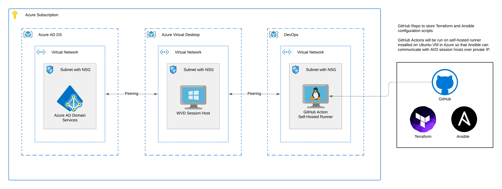

# azure-avd-terraform

This basic implementation of Azure Virtual Desktop will be deployed using Terraform for Azure resource provisioning, Ansible for Windows session host configuration, and GitHub Actions to orchestrate it all.

Only the resources resources in the Azure Virtual Desktop Resource Group (illustrated in the middle of the diagram below) are within scope for this deployment.



## Prerequisites

To deploy this demo AVD solution within your environment, I am assuming you have the following resources in place:

1. A Windows Active Directory Domain Services Domain Controller or [Azure Active Directory Domain Services][aadds] deployed in Azure.
1. A [GitHub Account][github] to [clone][gitclone] this repo or [create a new repo from this template][gittemplate].
1. A [Ubuntu Virtual Machine][azlinuxvm] deployed in Azure with the following tools installed:
   - [GitHub Actions self-hosted runner][githubrunner]
   - [Azure CLI][azcli]
   - [Terraform][tf]
   - [Ansible][ansible]
   - Unzip
     > `sudo apt-get install unzip`
   - [Node.js][nodejs]
   - [npm][npm]

> The Terraform script will dynamically peer the AVD virtual network with any virtual network with the tag `role=azops` so make sure the virtual networks that host your **AD** and **DEVOPS** machines are tagged as such.

## Overview

The Terraform configuration will generate a "random pet name" to be used in naming Azure resources. This is fun for a demo, but you can change this as needed.

All Azure resources will be named using a naming convention of 2-4 character code based on the Azure service as the name prefix followed by a dash and the "random pet name". Again, if you don't like these names, you should change it.

This deployment also assumes you have full control of your subscription and have the proper permissions to create two sets of Azure Virtual Network Peerings; one between the AVD Virtual Network and AADDS Virtual Network and another between the AVD Virtual Network and DevOps virtual networks. If you don't have this level of access, you'll need to re-evaluate how much of this you can automate. I am working out of my sandbox Azure subscription and do not have limitations which you may run into in a production scenario.

The following resources will be deployed using Terraform:

- [Azure Resource Group][azrg]
- [Azure Virtual Network][azvnet] with a single subnet and [Network Security Group][aznsg] wrapped around it
  > The virtual network will also have [custom DNS configured][azdns] so that your AVD session host VM can communicate with the domain controller when it comes time to domain join.
- [Azure Virtual Network peerings][azvnetpeer] to and from AVD virtual network for AADDS and DevOps
- [Azure Virtual Desktop Host Pool][avdhp] and the host pool registration token will be exported as an output in the Terraform configuration
- [Azure Virtual Desktop Application Group][avdag]
- Azure Virtual Desktop Workspace
- [Windows Virtual Machine(s)][azwinvm] with a [Custom Script Extension][azvmcse] to configure [WinRM for Ansible][answinrm]
- A local Ansible inventory file which will include host name and IP to run the Ansible playbook against

## Terraform Setup

Terraform requires you to manage state files. You can choose to store remote state in [Azure Storage Account][tfazstorage] or in [Terraform Cloud][tfcloud]. Whichever solution you choose, be sure to update the [`backend.tf`](backend.tf) file to reflect your remote state solution. This repo uses Terraform Cloud and for the GitHub Action to work with your Terraform Cloud account, you will need to create an [API token][tfcloudauth] and save it as a [GitHub Secret][githubsecrets] named `TF_API_TOKEN`. The `backend.tf` file is a [partial configuration][tfbackendconfig]. The rest of my backend configuration is kept in a file called `config.remote.tfbackend` per Terraform's [recommended naming pattern][tfbackendconfigfile]. This file is purposely NOT commited to the repo and passed in during `terraform init` (at runtime).

In Terraform Cloud, you also have the option of running your Terraform script on Hashicorp's cloud infrastructure, but I chose to run it locally on the GitHub self-hosted runner installed on my DevOps VM in Azure. This will enable the GitHub Action to use the Ansible inventory file when it comes time to call the Ansible playbook and reach AVD Session Host VMs by private IP as the self-hosted runner is deployed in a peered virtual network. Taking this route will require the use of an [Azure Service Principal][azspn] to run the Terraform commands. Once you have the secret values, enter them in [GitHub Secrets][githubsecrets] using the following names

- `ARM_CLIENT_ID`
- `ARM_CLIENT_SECRET`
- `ARM_SUBSCRIPTION_ID`
- `ARM_TENANT_ID`

> **NOTE:** You could name the GitHub secrets anything you want but you'll need to make sure they are consistent with what is in the [`terraform.yml`](./github/workflows/terraform.yml) workflow file.

This repo also includes variables for re-usability. The variable definitions can be found in the [`variables.tf`](variables.tf) file. The vaules for each deployment are maintained in a `*.tfvars` file and I've included a [`sample.tfvars`](sample.tfvars) file so you will need to update based on what is deployed in your environment.

To run the Terrafrom script locally, take a look at the [`terraform.yml`](./github/workflows/terraform.yml) workflow file. There you'll find a `terraform plan` and `terraform apply` command with all the arguments you'll need.

> **NOTE:** If you decide to change the name of the sample.tfvars file, you'll also need to update the filename in the workflow.

### Virtual Network Peerings

You may run into a situation where the virtual networks you need to peer with are in different subscriptions. In my lab environment, I have a DevOps VM in a DevOps subscription and a AD DS VM in a Network Operations subscription (Hub Virtual Network or NetOps). In order for this pipeline to run successfully, it will need to be able to peer out to the virtual networks in the external subscriptions and peer back in from the virtual networks in the external subscriptions.

To do this, we'll use separate AzureRM providers for each subscription we need to interact with: one for DevOps and another for NetOps. The providers will be aliased and given a subscription id. Be sure to set the subscription id in your \*.tfvars file. If your DevOps and NetOps resources are in the same subscription, you should be able to simply pass in the same subscription id for each.

When Terraform does the peering, it will query the DevOps and NetOps subscriptions for any virtual networks that have a specific tag. This way we can dynamically peer with any virtual network and not have to hard-code resource ids in the \*.tfvars file. So make sure your DevOps and NetOps virtual networks have been tagged. I used `role=azops` as a key-value pair.

## Ansible Setup

The `site.yml` [Ansible Playbook][ansplaybook] found in this repo relies on a few variables needed to connect to your VM, install the RDSAgent software for registering it as a AVD Session Host, and performing a domain join. Rather then saving credentials to the repo (which is never a good thing), we'll use `ansible-vault` to encrypt contents leveraging [Ansible Vault][ansvault]. The encrypted vault will be commited to the repo as `secrets.yml`.

> **NOTE:** `secrets.yml` file in this repo contains info specific to my deployment so you'll need to overwrite it with your own.

Let's start by creating a vault file:

```sh
ansible-vault create secrets.yml
```

You will be prompted for a password. Enter a super-secret password. Make it hard to brute force ;-)

> **NOTE:** You will also need to save the vault password as a GitHub repo Secret named `ANSIBLE_VAULT_PASSWORD` for the GitHub Action workflow to use.

After the vault password has been set, a VI editor will open.

> **NOTE:** Be sure to hit the `i` key to put yourself in `insert` mode and enter the following:

```text
ansible_user: <YOUR_VM_USERNAME>
ansible_password: <YOUR_VM_PASSWORD>
dns_domain_name: <YOUR_DOMAIN_NAME>
domain_admin_user: <YOUR_DOMAIN_USERNAME>
domain_admin_password: <YOUR_DOMAIN_PASSWORD>
domain_ou_path: <YOUR_DOMAIN_DISTINGUISHED_OU_PATH>
```

> **NOTE:** Save the file using the following command `:wq!`

If you need to update the vault, you can run the following command to edit the file:

```sh
ansible-vault edit secrets.yml
```

> **NOTE:** You will be prompted to enter your vault password

With the vault file saved to the repo, the GitHub Action workflow will use the `ANSIBLE_VAULT_PASSWORD` to unlock the vault when the Ansible playbook is invoked.

To view the Ansible playbook command, take a look at the [`terraform.yml`](./github/workflows/terraform.yml) workflow file and look for the Ansible Playbook task. You'll see that the command passes extra variables for the Host Pool registratin token and passes the variables found in `secrets.yml` vault file into the playbook.

More on Ansible Secrets here:

- [Encrypting content with Ansible Vault][ansvault]
- [Handling secrets in your Ansible playbooks][anssecrets]

### GitHub Action Setup

If you configured all the [GitHub secrets][githubsecrets] (listed in steps above), you will see a GitHub Action workflow running each time you do a push or pull request into the main branch. At this point, there's nothing else you need to do here. Now, go watch it run and have fun!!

## Clean Up

When you are ready to clean things up, you can run the following command:

```sh
terraform destroy -var-file=sample.tfvars -var=username=user -var=password=pass
```

[aadds]: https://azure.microsoft.com/en-us/services/active-directory-ds/
[github]: https://github.com/join
[gitclone]: https://docs.github.com/en/github/creating-cloning-and-archiving-repositories/cloning-a-repository-from-github/cloning-a-repository
[gittemplate]: https://docs.github.com/en/github/creating-cloning-and-archiving-repositories/creating-a-repository-on-github/creating-a-repository-from-a-template
[azlinuxvm]: https://docs.microsoft.com/en-us/azure/virtual-machines/linux/quick-create-portal
[githubrunner]: https://docs.github.com/en/actions/hosting-your-own-runners/about-self-hosted-runners
[azcli]: https://docs.microsoft.com/en-us/cli/azure/install-azure-cli-linux?pivots=apt
[tf]: https://www.terraform.io/docs/cli/install/apt.html
[ansible]: https://docs.ansible.com/ansible/latest/installation_guide/intro_installation.html#installing-and-upgrading-ansible-with-pip
[nodejs]: https://nodejs.org/en/download/package-manager/#debian-and-ubuntu-based-linux-distributions
[npm]: https://docs.npmjs.com/downloading-and-installing-node-js-and-npm
[azrg]: https://docs.microsoft.com/en-us/azure/azure-resource-manager/management/manage-resource-groups-portal
[azvnet]: https://docs.microsoft.com/en-us/azure/virtual-network/virtual-networks-overview
[aznsg]: https://docs.microsoft.com/en-us/azure/virtual-network/network-security-groups-overview
[azdns]: https://docs.microsoft.com/en-us/azure/virtual-network/virtual-networks-name-resolution-for-vms-and-role-instances
[azvnetpeer]: https://docs.microsoft.com/en-us/azure/virtual-network/virtual-network-manage-peering
[avdhp]: https://docs.microsoft.com/en-us/azure/virtual-desktop/create-host-pools-azure-marketplace
[avdag]: https://docs.microsoft.com/en-us/azure/virtual-desktop/manage-app-groups
[azwinvm]: https://docs.microsoft.com/en-us/azure/virtual-machines/windows/quick-create-portal
[azvmcse]: https://docs.microsoft.com/en-us/azure/virtual-machines/extensions/custom-script-windows
[answinrm]: https://docs.ansible.com/ansible/latest/user_guide/windows_winrm.html
[tfazstorage]: https://docs.microsoft.com/en-us/azure/developer/terraform/store-state-in-azure-storage
[tfcloud]: https://www.terraform.io/cloud
[tfcloudauth]: https://www.terraform.io/docs/cloud/users-teams-organizations/users.html#api-tokens
[githubsecrets]: https://docs.github.com/en/actions/reference/encrypted-secrets#creating-encrypted-secrets-for-a-repository
[azspn]: https://registry.terraform.io/providers/hashicorp/azurerm/latest/docs/guides/service_principal_client_secret
[ansplaybook]: https://docs.ansible.com/ansible/latest/user_guide/playbooks.html
[ansvault]: https://docs.ansible.com/ansible/latest/user_guide/vault.html
[anssecrets]: https://www.redhat.com/sysadmin/ansible-playbooks-secrets
[tfbackendconfig]: https://www.terraform.io/language/settings/backends/configuration#partial-configuration
[tfbackendconfigfile]: https://www.terraform.io/language/settings/backends/configuration#file
